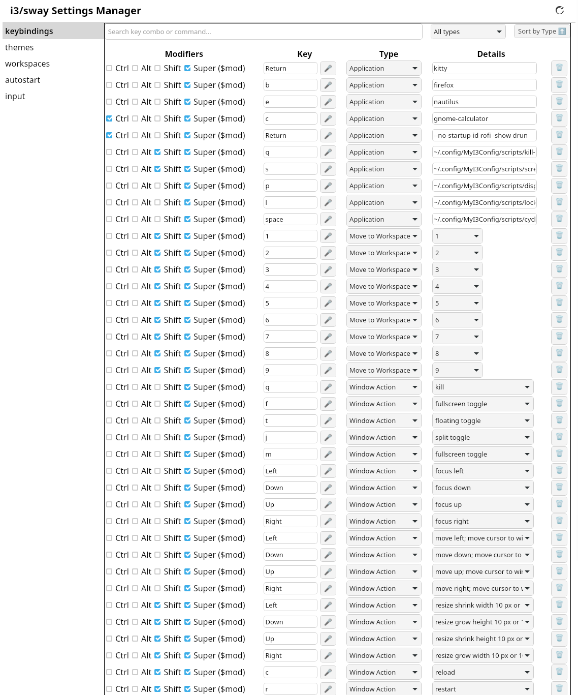
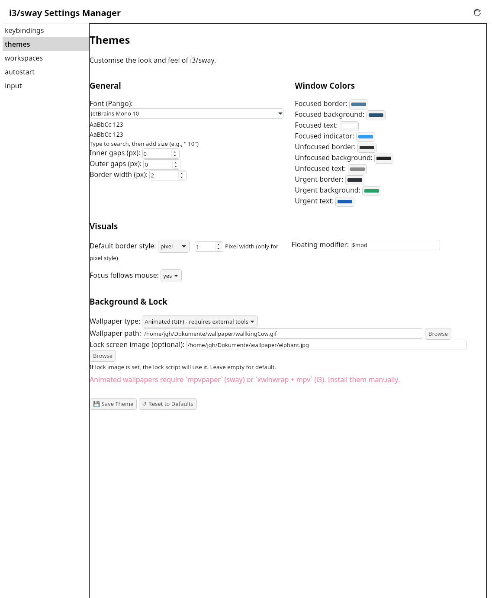
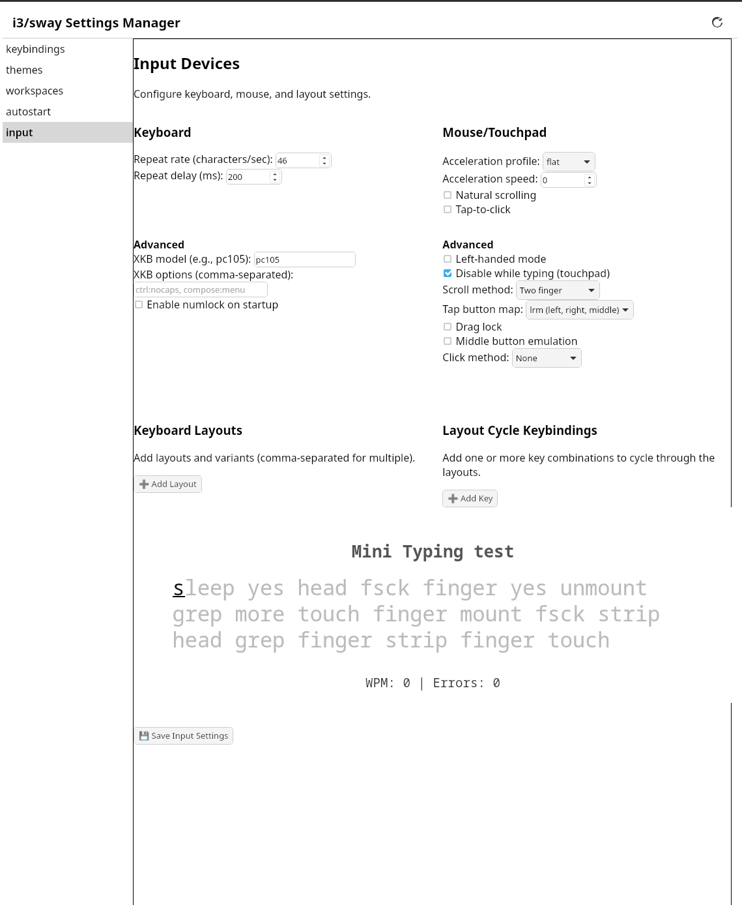
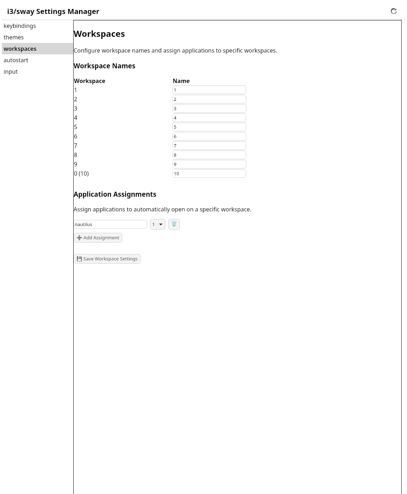
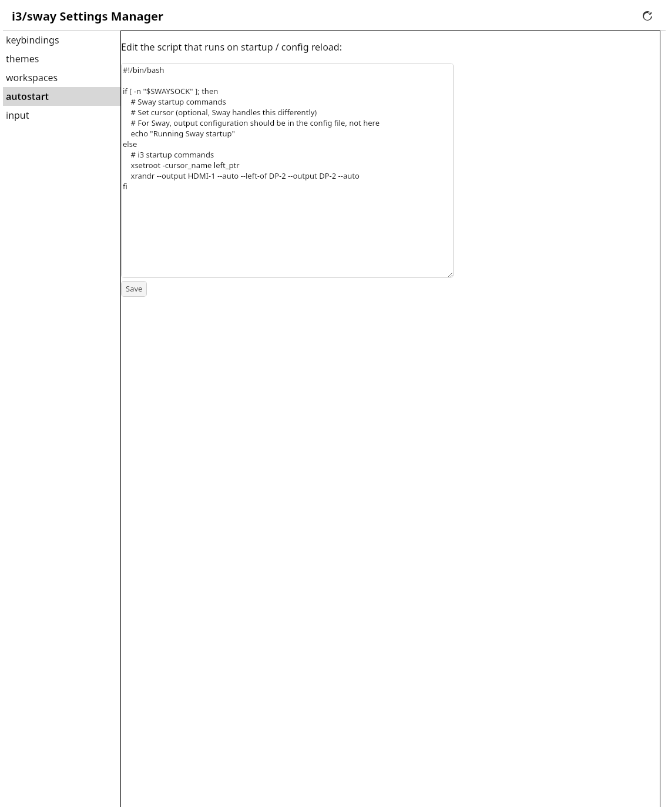

# MyI3ConfigSettings

A **Tauri‑based graphical settings manager** for [MyI3Config](https://github.com/JGH0/MyI3Config). It provides an intuitive interface to customise keybindings, theme settings, input devices, workspaces, and autostart scripts – without touching text files.

---

## Features

### Keybindings Editor
- **Live key capture** – click the record button and press any key combination; the app formats it for i3/sway.
- **Multiple binding types**: Application (command), Window action (built‑in i3/sway commands), Switch workspace, Move to workspace, Resize (configurable amount/unit).
- **Search & filter** – quickly find bindings by key, command, or type.
- All changes are staged until you click **Save All Changes**.


### Theme Editor
- **Font selection** – autocomplete from all system fonts with live preview.
- **Gaps** – inner and outer gap width.
- **Window colours** – colour pickers for focused, unfocused, and urgent windows (border, background, text, indicator).
- **Border style** – normal, pixel (with configurable width), or none.
- **Floating modifier** and **Focus follows mouse** toggle.
- **Wallpaper** – static or animated (GIF) with automatic detection of i3 (feh) or Sway (swaybg / mpvpaper).
- **Lock screen image** – optional image for i3lock / swaylock.


### Input Devices
- **Keyboard** – repeat rate/delay, XKB model, XKB options, numlock on startup.
- **Mouse/Touchpad** – acceleration profile, speed, natural scrolling, tap‑to‑click, left‑handed mode, disable while typing, scroll method, button mapping, drag lock, middle emulation, click method.
- **Keyboard layouts** – add any number of layouts (e.g. us, ch) with optional variants (e.g. workman, de). Bind a key to cycle through them.
- **Typing test** – evaluate layout and keyboard feel with a live speed/accuracy test.


### Workspaces
- **Rename workspaces** (1‑10) – custom names that appear in your bar.
- **Application assignments** – assign applications (by class) to automatically open on a specific workspace.


### Autostart
- **Edit `startup.sh`** – the script that runs on i3/sway startup. Simple text editor.


### Additional Features
- **Reload button** – run `i3-msg reload` or `swaymsg reload` to apply changes instantly.
- **Auto‑reload after saving** (optional) – the app can reload i3/sway automatically.
- All settings are stored in `~/.config/MyI3Config/` as JSON files (`keybindings.json`, `theme.json`, `input.json`, `workspaces.json`, etc.). The corresponding `.conf` snippets are generated automatically.

---

## Installation

### Prerequisites
- **Tauri prerequisites** – Rust, Node.js, and system libraries (see [Tauri docs](https://tauri.app/start/prerequisites/))
- **jq** – for generating `.conf` files (installed by the MyI3Config installer)

### Build from Source
```bash
git clone https://github.com/JGH0/MyI3ConfigSettings.git
cd MyI3ConfigSettings
npm install
cargo tauri build
```
The executable will be in `src-tauri/target/release/myi3configsettings`. You can copy it to `~/.local/bin` or install via the MyI3Config installer (which can download a pre‑built binary).

### Pre‑built Packages
Releases include a **`.tar.gz` archive** with the binary, as well as `.deb` and `.rpm` packages. Download and run the binary or install the package.

---

## Usage

1. **Launch the app** (from terminal or your application menu).
2. **Select a category** in the left sidebar.
3. **Make changes** – use the provided controls, record key combinations, pick colours, etc.
4. **Click Save** (or Save All Changes for keybindings).
5. **Reload i3/sway** (the app has a reload button) to apply.

The app writes your changes to the JSON files and automatically regenerates the `.conf` snippets. No manual editing required.

---

## Configuration Files (User‑specific)

All files are stored in `~/.config/MyI3Config/`:

- `keybindings.json` – your keybindings
- `keybindings.conf` – generated i3/sway bindsym lines
- `theme.json` – theme preferences
- `theme.conf` – generated i3/sway theme directives
- `input.json` – input device settings
- `input.conf` – generated input configuration
- `workspaces.json` – workspace names and assignments
- `workspaces.conf` – generated workspace rules
- `scripts/` – user scripts (e.g. `lock.sh`, `theme-startup.sh`)

These files are ignored by git in the MyI3Config repository, so your personal settings remain private.

---

## Platform Notes

### Linux (i3 / Sway)
- All features available: keybindings, themes, input, workspaces, autostart
- Generates `.conf` snippet files included by the main i3/sway config
- Reload via `i3-msg reload` or `swaymsg reload`

### macOS (AeroSpace)
- **Keybindings** ✓ – translates i3-style bindings to AeroSpace TOML in `~/.aerospace.toml`
  - `$mod` → `cmd`
  - `bindsym` → TOML `key = 'command'` format
  - Preserves all other sections of your existing `~/.aerospace.toml`
- **Workspaces** ✓ – updates `persistent-workspaces` in `~/.aerospace.toml`
- **Autostart** ✓ – edits `scripts-aerospace/startup.sh`
- **Themes** ✗ – AeroSpace does not support borders, colors, or font theming. Shows a notice.
- **Input** ✗ – macOS handles input through System Settings. Shows a notice.
- Reload via `aerospace reload-config`

---

## Development

- **Frontend**: vanilla HTML/CSS/JS (no framework)
- **Backend**: Tauri (Rust) with plugins:
  - `fs` – file operations
  - `dialog` – file pickers
  - `shell` – executing reload commands
  - `opener` – (unused)
- **Custom commands**:
  - `list_fonts` – uses `font-kit` crate to list system fonts
  - `set_executable` – sets file permissions to executable

To add a new category, create a new `.html` and `.js` file in `src/settings/` and add a corresponding `<ul data-page="...">` in `index.html`.

---

## Contributing

Issues and pull requests are welcome. Please ensure changes are compatible with the core MyI3Config repository.

---

## License

MIT License – see [LICENSE](LICENSE) for details.